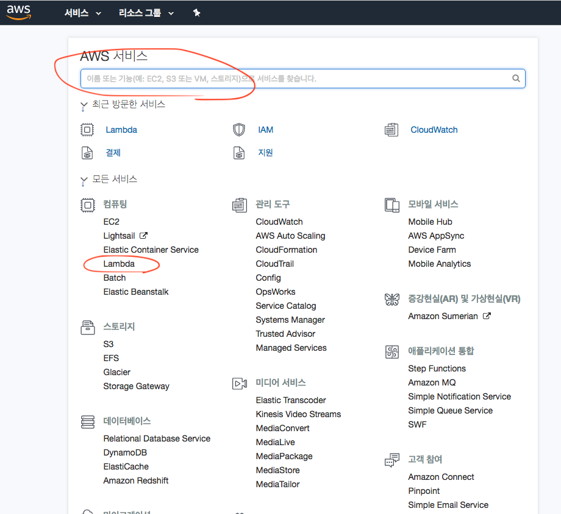
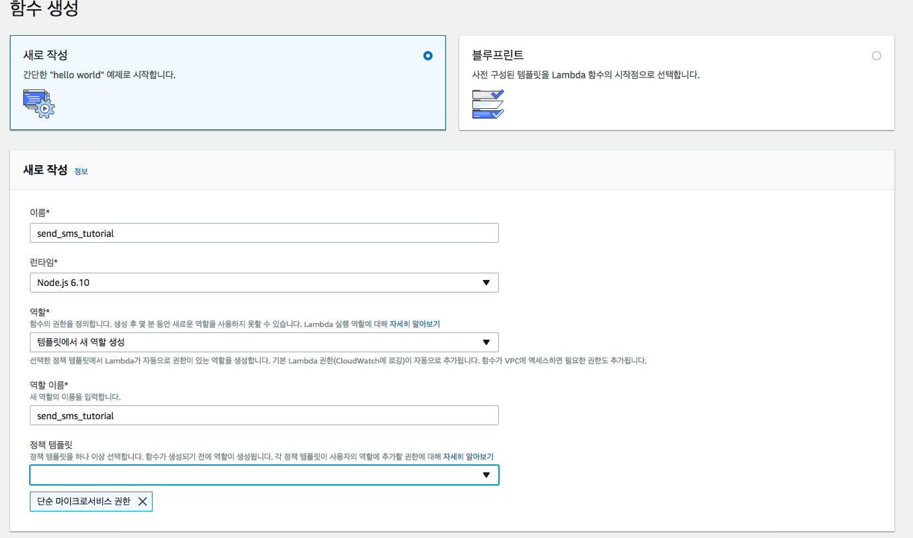
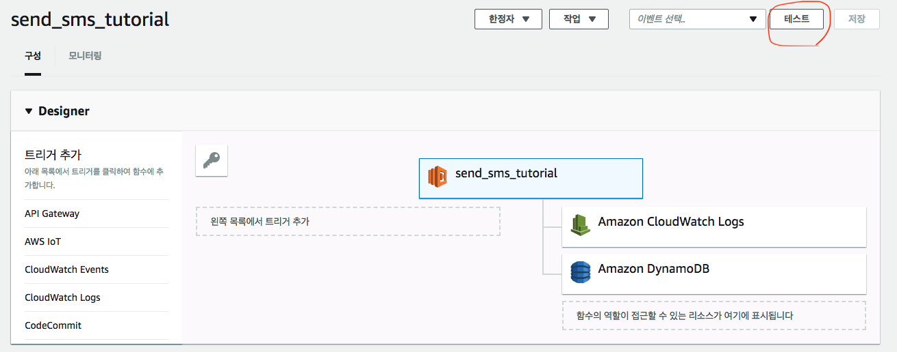
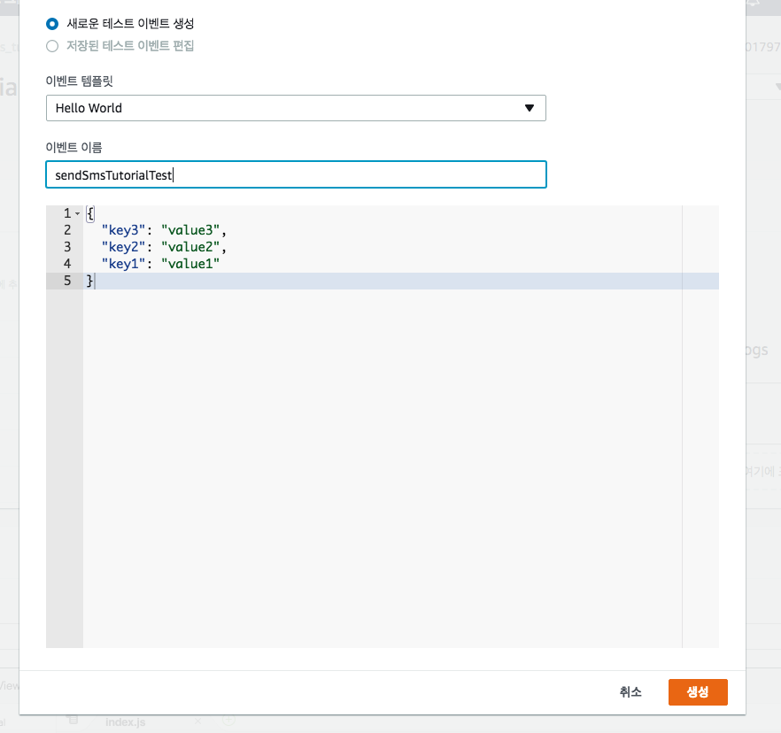
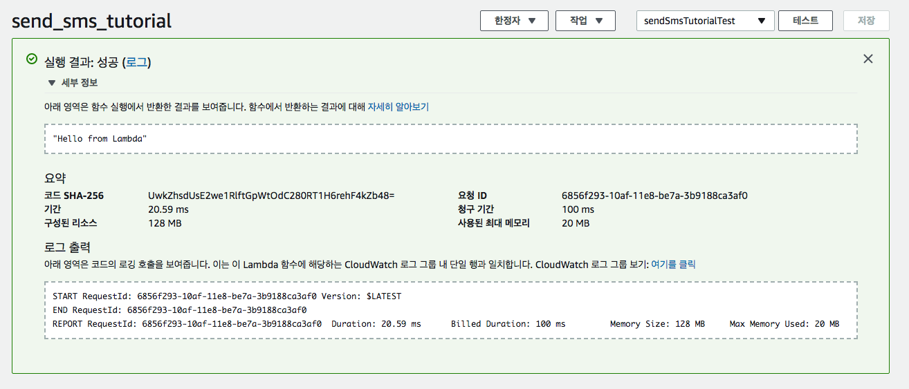
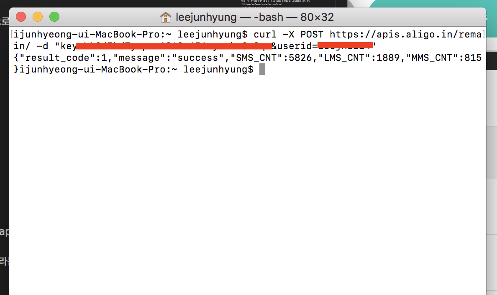
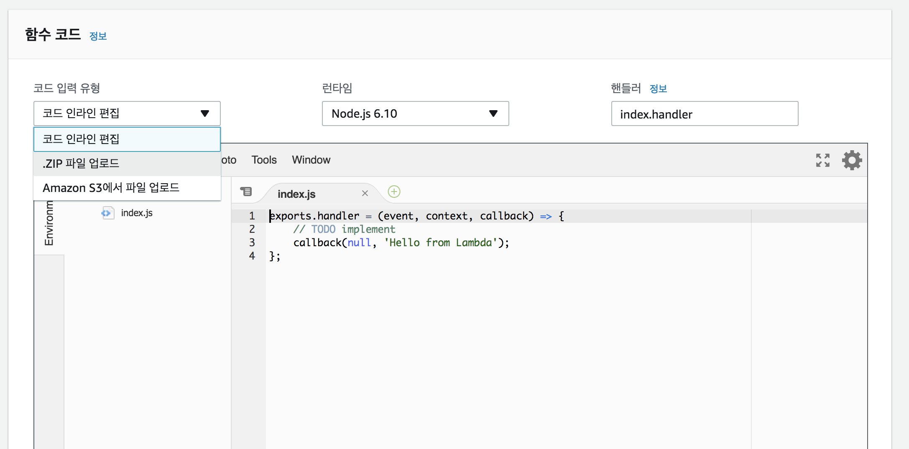
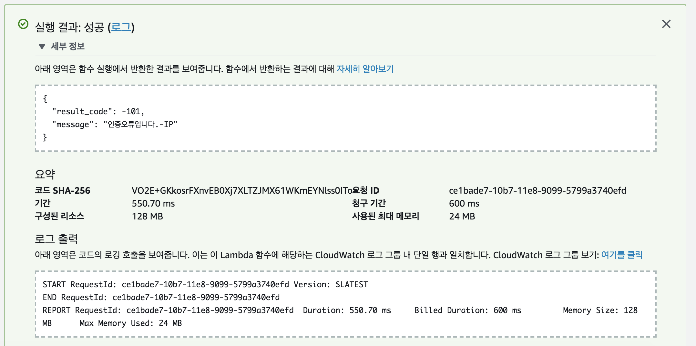

# Aws 고오급 튜토리얼

## hello world 를 넘어서

0.  Why lambda?

람다.

많이는 들어봤다.

서버리스, 클라우드 컴퓨팅이란다.

왠지 배워둬야할 것 같다. 문제는 ... 왜?

기존의 서버 관리란 굉~장히 귀찮은 일이었다.

도커(Docker)가 널리 사용되면서 상당히 편해졌다고는 하지만 여전히 신경써줘야할 부분이 많다.

그런데 대기업(Amazon 이나 Google)에서 이런 모든 제반환경을 관리해주고 나는 코드만 올려서 사용할 수 있다면?

최고의 시나리오라고 할 수 있다.

게다가 소규모 서비스(이메일, 문자 전송 / 정기적인 알림) 하나를 위해서 독자적 서버를 관리하는 일은 그 규모가 크면 모르겠지만

규모가 작다면 시간 낭비 / 돈낭비에 가깝다.

그러니 오늘 람다를 배워서 당장 써먹어보자. Hello World 말고 진짜로.

1.  들어가며

람다를 배워보기로 했으니 일단 amazon 계정 정도는 있을 것이라고 가정하고(만약 없다면 이참에 만들자. 새로 가입하면 12 개월 간은 free-tier 내에서 서비스를 공짜로 이용할 수 있다.) 시작해보겠다.

본격적으로 람다를 배워보기로 했으니 일단 람다를 만드는 것부터 해보자.

아마존 관리 콘솔로 들어가면 다음과 같은 화면이 보일 것이다. 이제 상단에 lambda 를 검색하거나 컴퓨팅 탭의 Lambda 를 선택해서 들어가자.



콘솔에 들어가니 함수를 생성할 수 있는 주황색 버튼이 보인다. 눌러주자.

내 계정의 경우 이미 두 개의 함수가 정의되어 있다. 신경쓰지 말고 새로 하나 만들자.


함수 생성을 누르면 다음과 같은 화면이 나오는데 우리는 일단 간단하 hello world 예제에서부터 시작하겠다.

여기서 아래와 같이 입력해주고 오른쪽 아래 함수 생성을 눌러주자.



자, 이제 람다도 생성됐으니 우리가 무엇을 만들지 한 번 생각해보자.

2.  이 람다는 무슨 람다인고?

[Wix 문자 서비스 추가 삽질기](https://gompro.postype.com/post/1569658)

그렇다. 나는 Wix 에 문자 서비스를 추가하기 위해 꽤나 고생했었다.

그리고 문자 서비스가 정상적으로 잘 돌아가는 걸 보니 이 모든 과정을 기록해놓고 다른 사람들과 공유하고 싶었다.

그러므로 오늘의 목표는 "알리고 문자 서비스 api 를 이용한 문자 전송 람다" 만들기다.

만약 본인의 프로젝트에 문자 전송 기능을 추가할 일이 있다면 이 튜토리얼을 읽는게 꽤 많은 도움이 될 것이다.

그럴 일은 없겠지만 2 편을 쓰게 된다면 sendGrid 를 이용한 메일 보내기도 써볼까 생각 중이다.

아무튼 다시 람다 관리화면으로 돌아가서 람다가 잘 돌아가는지부터 확인해보자.

화면 상단의 테스트를 클릭하면 테스트를 생성할 수 있는데 아무 이름이나 넣어주고 생성 버튼을 눌러주자.





아래와 같이 Hello from Lambda 를 볼 수 있다면 정상작동하고 있다는 뜻이다.



여기까지가 일반적인 람다 튜토리얼이다. 부족하지 않은가? 좀 많이 부족하다.

우리는 Hello World 보다는 복잡한 걸 해보고 싶으니 말이다.

3.  알리고

[알리고](https://smartsms.aligo.in/main.html)에 들어가서 가입한 뒤 상단의 API 연동으로 들어가보자.

[담당자]-[기존 API Key]-[발송 IP]-[발신번호]의 네 가지 항목이 있다. 천천히 기입해주자.

IP 주소의 경우 테이블 아래에 현재 접속한 IP 주소가 표시된다. 이 주소를 넣어주자.

이제 API spec 을 읽어보자.

[문자보내기](https://smartsms.aligo.in/admin/api/spec.html#send)

심플하다! 크게 신경 쓸만한 건 없어보인다.

테스트를 한 번 해보자.

http 요청을 테스트하는 방법은 여러가지지만 아무래도 터미널에 하는게 제일 심플하니 터미널을 켜고 api spec 에 나온 대로 요청을 한 번 보내보자.

아, 아직 결제를 하지 않았더라도 테스트를 해볼 수 있다.

스펙 문서 아래쪽에 보면 문자 발송 건수를 확인하는 /remain/이 있다. 여기에 테스트 요청을 보내보자.

`curl -X POST https://apis.aligo.in/remain/ -d "key=YOUR_API_KEY&userid=YOUR_USER_ID"`



성공적으로 잘 요청된다.

만약 요청이 실패한다면 요청을 보내는 endpoint 가 /remain 이 아닌 /remain/인지 확인해보세요.

4.  코드 작성

이제 코드를 작성해보자.

`mkdir aligo-send-sms`
`cd aligo-send-sms`
`yarn init -y 혹은 npm init -y`
`touch source.js // 직접 작성할 파일`

source.js 에 아래와 같이 적어주자.

```js
import axios from 'axios'

exports.handler = (event, context, callback) => {
  const options = {
    headers: {
      'Content-type': 'application/x-www-form-urlencoded',
    },
  }

  const formatToQueryString = ([key, value]) => {
    if (key === 'msg') {
      return `${key}=${encodeURI(value)}` // workaround for Korean messages
    }
    return `${key}=${value}`
  }

  // polyfill
  Object.entries = object => Object.keys(object).map(key => [key, object[key]])

  const withCredentials = {
    ...event,
    key: process.env.ALIGO_API_KEY,
    userid: process.env.ALIGO_USER_ID,
    sender: process.env.ALIGO_SENDER_PHONE_NUMBER,
  }

  const queryString = Object.entries(withCredentials)
    .map(formatToQueryString)
    .join('&')

  const url = `https://apis.aligo.in/send/?${queryString}`

  axios
    .post(url, options)
    .then(({ data }) => {
      callback(null, data)
    })
    .catch(err => {
      callback(null, {
        error: err,
      })
    })
}
```

여기서 잠깐 event / context / callback 의 세 인자에 대해 설명하자면

1.  event - 데이터를 전달
2.  context - 람다 실행시간, 람다명이나 버전 등의 정보를 저장
3.  callback - 람다 실행결과를 리턴

간략하게 위와 같이 이해할 수 있다.

코드를 읽다보면 람다의 노드 런타임이 6.10 인데 spread operator(...)나 import 구문을 사용할 수 있어? 하는 의문이 들 수도 있다.

맞다. 그냥은 못 쓴다. 대신 방법이 있다.

또 process.env.XXX 는 무엇인지 궁금한 분들이 있을 수도 있다. 이제 다음 챕터로 넘어가자.

5.  lambda 에서 es6 문법 사용하기 / 환경변수 사용하기

Node.js 에서 es6 문법을 사용할 땐 바벨 설정을 해줬다.


워워 진정하자. 바벨 설정은 생각보다 어렵지 않다. 처음부터 찬찬히 해보자.

주의 깊은 독자라면 우리가 왜 첫 파일의 이름을 index.js 가 아닌 source.js 라 했는지 의문이 생길 수도 있다.

그렇다. source.js 를 트랜스파일한 index.js 가 실제로 람다에 업로드될 파일(람다는 인라인 편집말고도 파일 업로드를 지원한다. 챕터 6 에서 알아보자)이다.

babel-cli 와 plugin 들부터 설치해주자.

`yarn add babel-cli babel-preset-env babel-preset-stage-3

혹은

npm install --save babel-cli babel-preset-env babel-preset-stage-3
`

그 다음에 .babelrc 파일을 생성하고

```json
{
  "presets": [
    [
      "env",
      {
        "targets": { "node": "6.10" } // 람다의 런타임 버전에 해당하는 숫자를 적어주자. 람다가 지원하는 최신 버전이 6.10이라 6.10로 적었다.
      }
    ],
    "stage-3"
  ]
}
```

위와 같이 입력해주자.

이제 package.json 에다

`"scripts": { "transpile": "npx babel source.js -o index.js" },`

트랜스파일 명령어를 추가됐다. 이제 source.js 에서 작업하고 파일을 업로드할 땐

`yarn transpile 혹은 npm run transpile`

명령어를 실행하고 node_modules 폴더와 index.js 를 압축하여 올리면 된다.

바벨에 대해서는 나보다 더 잘 알고 더 잘 설명하신 분의 글이 있어 남겨본다.

[(번역)Babel 에 대한 모든 것](https://jaeyeophan.github.io/2017/05/16/Everything-about-babel/)

공식문서에도 자세하게 잘 나와있다.

[바벨 플러그인](https://babeljs.io/docs/plugins/)

다음은 환경변수 설정이다.

환경변수 설정 메뉴는 함수 코드 메뉴 아래에 있으며 그냥 키-값 형태로 작성하면 된다.


이제 본격적으로 코드를 업로드해보자.

6.  lambda 코드 zip 파일로 올리기

람다는 기본적으로 인라인 편집 기능 말고도 zip 파일 업로드와 s3 버킷을 통한 파일 업로드를 지원한다.

우리는 zip 파일(node_modules 와 index.js)을 업로드할 것이다.




이제 테스트를 재구성할 시간이다.


성공적으로 테스트 재구성을 마쳤다면 아래와 같은 에러 메시지를 받을 것이다.



아니 IP 주소 에러라니 우리 맨처음에 현재 접속한 IP 주소를 등록한거 아니었어?

하는 분들도 있을 수 있겠다.

물론 등록했다. 현재 접속 중인 IP 주소를.

근데 우리가 람다가 실행되는 IP 주소를 등록했던가? 아니다.

구글에 aws lambda ip address 라고 입력하면

[aws ip 주소 범위](https://docs.aws.amazon.com/ko_kr/general/latest/gr/aws-ip-ranges.html) 게시글을 찾을 수 있다.

위 문서를 읽어보면 알겠지만 결론은 aws 에서 제공하는 람다 서비스는 고정된 ip 주소를 가지고 서비스되는게 아니라는 말이다.

유동적으로 일정 범위 내에서 계속해서 다른 주소를 사용하는 것이다.

문제는 알리고뿐만 아니라 모든 국내 문자 서비스 사업자는 미리 등록된 Ip 주소에서만 문자를 보낼 수 있게 강제하고 있다는 것.

그렇다면 모든 ip 주소 대역을 다 등록하면 되지 않을까? 안 된다.

위의 ip 주소 범위에 들어가 json 파일을 다운받고 lambda 를 검색해보자. ap-northeast-2 리전에만 해도 몇십개의 대역이 할당돼 있다.

그런데 우리가 등록할 수 있는 한계는 40 여개 정도다. 즉 모든 ip 주소를 등록하는 일은 불가능하다. 물론 귀찮기도 하고.

물론 다~ 방법이 있다. 이 내용은 상당히 길어지므로 오늘은 여기까지 끝맺고 2 편에서 더 흥미로운 주제를 다뤄보자.

* 다음 글에서는
  aws lambda 를 api gateway 및 vpc 와 연동해서 사용하기(고정 ip 주소로 람다 사용하기) /
  aws lambda 주기적으로 실행시키기의 두 가지 주제를 다룰 예정입니다.
